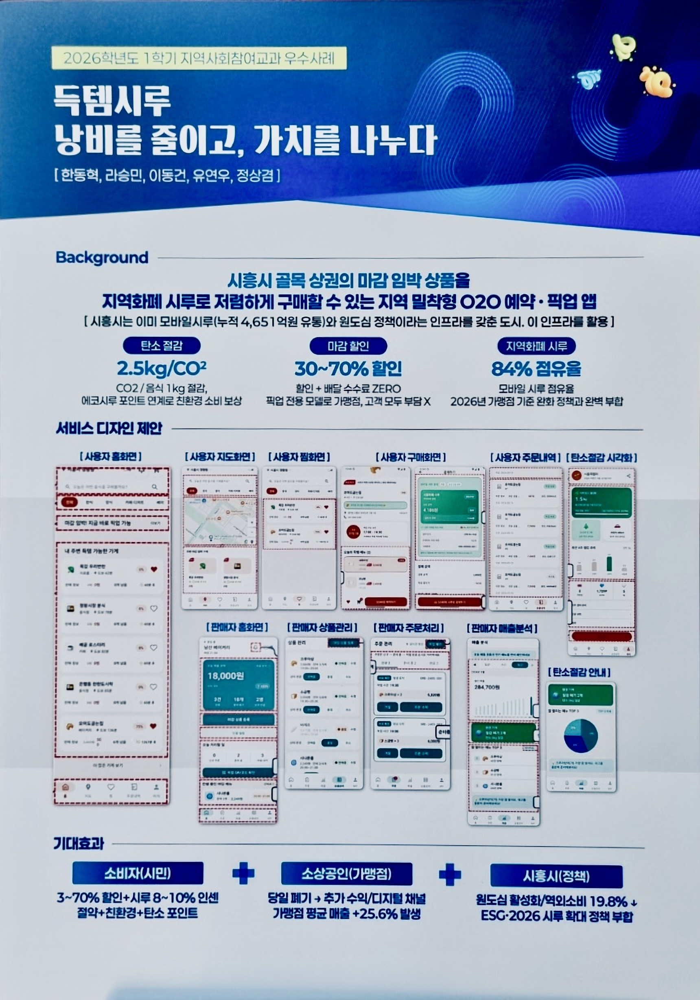

<h1 align="center">득템시루</h1>

<p align="center">
  <b>오늘 팔리지 않으면 버려지는 상품을 가까운 소비자에게 빠르게 연결합니다</b><br/>
  시흥시 지역화폐 시루 기반 마감 할인 픽업 커머스 프로젝트
</p>

<p align="center">
  
  
  
  
</p>

<p align="center">
  <a href="https://github.com/deuktemsiru/frontend-buyer">Buyer App</a> /
  <a href="https://github.com/deuktemsiru/frontend-seller">Seller App</a> /
  <a href="https://github.com/deuktemsiru/backend">Backend</a>
</p>

---

## 프로젝트 소개

**득템시루**는 마감 임박 상품의 폐기를 줄이고, 사용자가 주변 매장에서 할인 상품을 픽업 주문할 수 있도록 만든 지역 커머스 서비스입니다.
구매자 Android 앱, 판매자 Android 앱, Spring Boot 백엔드, 랜딩 페이지로 구성됩니다.

<p align="center">
  
</p>

<p align="center">
  
</p>

## 팀 구성

<table>
  <tr><td align="center"><a href="https://github.com/Asterisk0707"></a></td><td><b>한동혁</b><br/><sub>Leader · Frontend · 발표</sub></td><td>구매자 앱, 지도 SDK, 장바구니·찜 UI, 경로 안내</td></tr>
  <tr><td align="center"><a href="https://github.com/yeonwuyoo"></a></td><td><b>유연우</b><br/><sub>Frontend · PPT</sub></td><td>판매자 앱, 픽업 코드, 상품관리·고객 알림 UI, 발표 자료</td></tr>
  <tr><td align="center"><a href="https://github.com/Movinggun-bit"></a></td><td><b>이동건</b><br/><sub>Backend · Infra</sub></td><td>백엔드 ERD·API 설계, Kakao 로그인 연동, AWS 배포</td></tr>
  <tr><td align="center"><a href="https://github.com/ken-jeong"></a></td><td><b>정상겸</b><br/><sub>기획 · 운영 · Full-stack</sub></td><td>구매자·판매자 앱, 백엔드 코어·정산 API, 테스트·문서·모니터링</td></tr>
  <tr><td align="center"><a href="https://github.com/Ra-seungmin"></a></td><td><b>라승민</b><br/><sub>Frontend</sub></td><td>구매자 앱</td></tr>
</table>

## 시스템 아키텍처

```text
[Buyer App] ─┐
             ├── REST API + JWT ──> Spring Boot ──> PostgreSQL
[Seller App] ┘                          └── Kakao API
```

두 Android 앱은 Kakao 또는 개발용 로그인으로 JWT를 발급받아 백엔드 API와 통신합니다.

## 핵심 기능

- **구매자** - 매장 탐색·지도, 장바구니, 시루 결제, 픽업 코드/QR, 길찾기, 찜
- **판매자** - 상품 등록, 주문 처리, 픽업 검증, 매출 분석, 고객 알림, 정산
- **백엔드** - 인증/인가, 매장·상품·주문 API, 픽업 검증, 알림, 모니터링